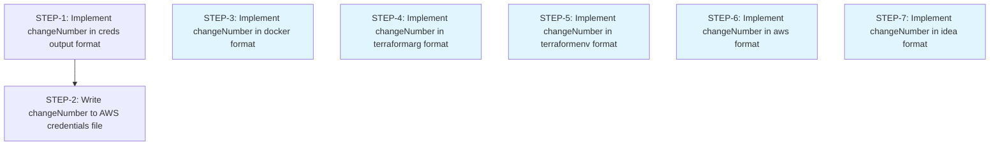

# Implementation Plan: Add ChangeMinder Change Number to All Output Formats

**Feature:** Add ChangeMinder Change Number to All Output Formats
**spec_source:** spec-driven/changeminder-output-formats/spec.md
**spec_hash:** a1d08bea375f8daabbc61ece3714c7bd2c92a0a7f67660f927ed4744546eb8aa
**version:** 1.0
**status:** final
**created:** 2026-03-23

---

## Overview

When users run `alks sessions open` with ChangeMinder flags (`--ciid`, `--activity-type`, `--description`), six output formats silently discard the change ticket number, leaving users unable to reference it. This plan implements changeNumber output for all missing formats: `creds`, `docker`, `terraformarg`, `terraformenv`, `aws`, and `idea`.

### Component Mapping

**Primary Component:** Output Formatting (`src/lib/getKeyOutput.ts`, `src/lib/updateCreds.ts`)
- All six FRs extend the existing switch-based output formatter
- FR-1 additionally modifies the credentials file writer to persist changeNumber in `~/.aws/credentials`

**Affected Files:**
- `src/lib/getKeyOutput.ts` - Main output formatter (all 6 FRs)
- `src/lib/updateCreds.ts` - Credentials file writer (FR-1 only)
- Test files to be created/modified per format

**Existing Pattern:** Five formats already output changeNumber (json, powershell, fishshell, linux, export/set). We follow the same conditional output pattern: only include changeNumber when it's defined.

### Test Strategy

- **Approach:** tdd
- **Framework:** jest
- **Pattern Reference:** Follow existing test patterns from `src/lib/getKeyOutput.test.ts` (if exists) or similar output formatting tests
- **Files Needing Tests:**
  - `src/lib/getKeyOutput.ts` (all 6 formats)
  - `src/lib/updateCreds.ts` (creds format only)

**Test Coverage Requirements (NFR-1):**
- Each format must have tests covering:
  - changeNumber present when provided (AC-*.1)
  - Output unchanged when changeNumber absent (AC-*.2)

---

## Traceability

| STEP | FR | AC | Files Modified | Effort |
|------|----|----|---------------|--------|
| STEP-1 | FR-1 | AC-1.1, AC-1.2 | getKeyOutput.ts, getKeyOutput.test.ts | M |
| STEP-2 | FR-1 | AC-1.1 | updateCreds.ts, updateCreds.test.ts | M |
| STEP-3 | FR-2 | AC-2.1, AC-2.2 | getKeyOutput.ts, getKeyOutput.test.ts | S |
| STEP-4 | FR-3 | AC-3.1, AC-3.2 | getKeyOutput.ts, getKeyOutput.test.ts | S |
| STEP-5 | FR-4 | AC-4.1, AC-4.2 | getKeyOutput.ts, getKeyOutput.test.ts | S |
| STEP-6 | FR-5 | AC-5.1, AC-5.2 | getKeyOutput.ts, getKeyOutput.test.ts | S |
| STEP-7 | FR-6 | AC-6.1, AC-6.2 | getKeyOutput.ts, getKeyOutput.test.ts | S |

---

## Phase 1: Walking Skeleton - Prove creds Format Pattern

**Goal:** Prove the changeNumber output pattern end-to-end with the most complex format (`creds`), which touches both output formatting and file writing.

### STEP-1: Implement changeNumber in creds output format
[FR-1 → AC-1.1, AC-1.2] | modify src/lib/getKeyOutput.ts | Effort: M

> **Intent:** The creds format returns empty string (no console output) since credentials are written to file by updateCreds.ts. However, getKeyOutput must still construct the Key object with changeNumber populated so downstream consumers (including updateCreds.ts) receive it. Missing this will cause updateCreds to receive undefined changeNumber even when the ticket was created.

**Implementation:**
- Write failing tests in `src/lib/getKeyOutput.test.ts` or create if missing:
  - When format is `creds` and changeNumber is defined, verify Key object includes changeNumber (AC-1.1)
  - When format is `creds` and changeNumber is undefined, verify backward compatibility (AC-1.2)
- Modify `src/lib/getKeyOutput.ts` in the `creds` case:
  - Ensure the returned value or data structure includes changeNumber when key.changeNumber is defined
  - Follow existing pattern from `json` format which already outputs changeNumber
- Reference existing changeNumber handling in json/powershell formats for conditional output pattern

**Dependencies:** None
**Enables:** STEP-2

**Verify:**
- `npm test -- --testPathPattern=getKeyOutput`
- `tsc --noEmit` (type check)

---

### STEP-2: Write changeNumber to AWS credentials file
[FR-1 → AC-1.1] | modify src/lib/updateCreds.ts | Effort: M

> **Intent:** AWS credentials files use INI format with `[profile-name]` sections. changeNumber must be written as a comment line (e.g., `# ALKS_CHANGE_NUMBER=CHG123456`) immediately above the profile section to preserve INI spec compliance. Writing it as a key-value pair within the section will cause AWS CLI to fail parsing unrecognized fields.

**Implementation:**
- Write failing tests in `src/lib/updateCreds.test.ts` or create if missing:
  - When changeNumber is present, verify it's written as a comment above the profile section
  - When changeNumber is absent, verify credentials file format unchanged
  - Verify comment format: `# ALKS_CHANGE_NUMBER=<value>`
- Modify `src/lib/updateCreds.ts`:
  - Before writing profile section via `propIni.addData`, insert comment line with changeNumber
  - Only add comment when `key.changeNumber` is defined
  - Follow INI comment syntax: lines starting with `#`
- Reference `src/lib/awsCredentialsFileContstants.ts` for field name constants

**Dependencies:** STEP-1 (proves changeNumber is available in Key object)

**Verify:**
- `npm test -- --testPathPattern=updateCreds`
- Integration test: Run `alks sessions open --ciid 123 -o creds` and inspect `~/.aws/credentials` for comment line
- `tsc --noEmit`

---

## Phase 2: Incremental Depth - Remaining Formats

**Goal:** Extend changeNumber output to the remaining five formats, following the pattern proven in Phase 1.

**Parallelization Note:** STEP-3 through STEP-7 are independent and can execute in parallel.

### STEP-3: Implement changeNumber in docker output format
[FR-2 → AC-2.1, AC-2.2] | modify src/lib/getKeyOutput.ts | Effort: S | **Parallel**

> **Intent:** Docker format outputs environment variables as `-e KEY=value` arguments for `docker run`. changeNumber must use the exact variable name `ALKS_CHANGE_NUMBER` (not `CHANGE_NUMBER`) to maintain consistency with existing ALKS-prefixed variables in terraform formats and avoid collision with user-defined container environment variables.

**Implementation:**
- Write failing tests in `src/lib/getKeyOutput.test.ts`:
  - When format is `docker` and changeNumber is defined, verify output includes `-e ALKS_CHANGE_NUMBER=<value>` (AC-2.1)
  - When format is `docker` and changeNumber is undefined, verify output unchanged (AC-2.2)
- Modify `src/lib/getKeyOutput.ts` in the `docker` case:
  - Append `-e ALKS_CHANGE_NUMBER=${key.changeNumber}` to output string when key.changeNumber is defined
  - Follow existing pattern for AWS credential variables
- Reference existing docker format output structure for spacing/formatting

**Dependencies:** None (independent of other Phase 2 steps)
**Enables (conceptual):** STEP-4, STEP-5, STEP-6, STEP-7 (proves pattern for env-style formats)

**Verify:**
- `npm test -- --testPathPattern=getKeyOutput`
- `tsc --noEmit`

---

### STEP-4: Implement changeNumber in terraformarg output format
[FR-3 → AC-3.1, AC-3.2] | modify src/lib/getKeyOutput.ts | Effort: S | **Parallel**

> **Intent:** Terraform argument format outputs as `-var key=value` for CLI usage. The variable name `alks_change_number` uses snake_case (not camelCase or CONSTANT_CASE) to match Terraform variable naming conventions. Using CONSTANT_CASE would cause Terraform to reject the variable as invalid syntax.

**Implementation:**
- Write failing tests in `src/lib/getKeyOutput.test.ts`:
  - When format is `terraformarg` and changeNumber is defined, verify output includes `-var alks_change_number=<value>` (AC-3.1)
  - When format is `terraformarg` and changeNumber is undefined, verify output unchanged (AC-3.2)
- Modify `src/lib/getKeyOutput.ts` in the `terraformarg` case:
  - Append `-var alks_change_number=${key.changeNumber}` to output string when key.changeNumber is defined
  - Follow existing pattern for AWS credential variables in terraformarg format
- Reference existing terraformarg variable naming (snake_case with alks_ prefix)

**Dependencies:** None (independent of other Phase 2 steps)

**Verify:**
- `npm test -- --testPathPattern=getKeyOutput`
- `tsc --noEmit`

---

### STEP-5: Implement changeNumber in terraformenv output format
[FR-4 → AC-4.1, AC-4.2] | modify src/lib/getKeyOutput.ts | Effort: S | **Parallel**

> **Intent:** Terraform environment variable format outputs as `export KEY=value` for shell sourcing. The variable name `ALKS_CHANGE_NUMBER` uses CONSTANT_CASE (not snake_case) to match shell environment variable conventions and distinguish from Terraform's -var arguments. Shell variables are case-sensitive — mixing cases will create separate variables.

**Implementation:**
- Write failing tests in `src/lib/getKeyOutput.test.ts`:
  - When format is `terraformenv` and changeNumber is defined, verify output includes `export ALKS_CHANGE_NUMBER=<value>` (AC-4.1)
  - When format is `terraformenv` and changeNumber is undefined, verify output unchanged (AC-4.2)
- Modify `src/lib/getKeyOutput.ts` in the `terraformenv` case:
  - Append `export ALKS_CHANGE_NUMBER=${key.changeNumber}` to output string when key.changeNumber is defined
  - Follow existing pattern for AWS credential variables in terraformenv format
- Reference `src/lib/isWindows.ts` for platform-specific command syntax if needed

**Dependencies:** None (independent of other Phase 2 steps)

**Verify:**
- `npm test -- --testPathPattern=getKeyOutput`
- `tsc --noEmit`

---

### STEP-6: Implement changeNumber in aws output format
[FR-5 → AC-5.1, AC-5.2] | modify src/lib/getKeyOutput.ts | Effort: S | **Parallel**

> **Intent:** AWS credential process format outputs JSON per AWS CLI's external credential provider spec (https://docs.aws.amazon.com/cli/latest/userguide/cli-configure-sourcing-external.html). changeNumber must be added as a top-level JSON property, not nested under another key. The property name should use camelCase (`changeNumber`) to match existing JSON keys like `sessionToken`, not snake_case or CONSTANT_CASE which would break naming consistency in the JSON output.

**Implementation:**
- Write failing tests in `src/lib/getKeyOutput.test.ts`:
  - When format is `aws` and changeNumber is defined, verify JSON output includes `"changeNumber": "<value>"` (AC-5.1)
  - When format is `aws` and changeNumber is undefined, verify JSON output unchanged (AC-5.2)
- Modify `src/lib/getKeyOutput.ts` in the `aws` case:
  - Add changeNumber property to JSON object when key.changeNumber is defined
  - Follow existing JSON structure (top-level property, camelCase naming)
- Reference existing aws format JSON structure

**Dependencies:** None (independent of other Phase 2 steps)

**Verify:**
- `npm test -- --testPathPattern=getKeyOutput`
- `tsc --noEmit`

---

### STEP-7: Implement changeNumber in idea output format
[FR-6 → AC-6.1, AC-6.2] | modify src/lib/getKeyOutput.ts | Effort: S | **Parallel**

> **Intent:** IntelliJ IDEA environment variable format outputs XML elements for run configuration import. changeNumber must be added as a new `<env>` element with name="ALKS_CHANGE_NUMBER", not as a text node or attribute on existing elements. Incorrect XML structure will cause IDEA to silently ignore the variable or fail to parse the run configuration entirely.

**Implementation:**
- Write failing tests in `src/lib/getKeyOutput.test.ts`:
  - When format is `idea` and changeNumber is defined, verify output includes ALKS_CHANGE_NUMBER in IDEA environment variable format (AC-6.1)
  - When format is `idea` and changeNumber is undefined, verify output unchanged (AC-6.2)
- Modify `src/lib/getKeyOutput.ts` in the `idea` case:
  - Add changeNumber to output in IDEA format when key.changeNumber is defined
  - Follow existing pattern for AWS credential variables in idea format
- Reference existing idea format structure (likely XML or special env var format)

**Dependencies:** None (independent of other Phase 2 steps)

**Verify:**
- `npm test -- --testPathPattern=getKeyOutput`
- `tsc --noEmit`

---

## Architecture Decisions

*No architecture decisions required. This feature extends existing output formatting logic following established patterns.*

---

## Risks

| Risk | Severity | Mitigation |
|------|----------|-----------|
| AWS credentials file corruption if changeNumber comment breaks INI parser | Medium | Test with real AWS CLI after updateCreds changes. Use standard INI comment syntax (`#`) recognized by all parsers. Add integration test that validates credentials file can still be parsed. |
| Platform-specific differences in output format (Windows vs Unix) | Low | Follow existing platform detection pattern in `src/lib/isWindows.ts`. Test on both platforms if possible. |
| Breaking change if user scripts parse output and don't expect changeNumber field | Low | Spec constraint: only output changeNumber when ChangeMinder flags provided. Existing usage without flags remains unchanged (AC-*.2 validates this). |

---

## Non-Functional Verification

| NFR | Target | Mapped STEPs | Verification Method |
|-----|--------|--------------|-------------------|
| NFR-1 | Unit tests for all modified output formats | STEP-1 through STEP-7 | Each STEP includes test bullets covering changeNumber presence/absence. Verify via `npm test -- --coverage` shows >80% coverage for modified functions. |
| NFR-2 | Follow TypeScript/Prettier/TSLint conventions | STEP-1 through STEP-7 | `tsc --noEmit` passes (type safety). `npm run prettier -- --check` passes. `npm run tslint` passes. Pre-commit hooks enforce on commit. |
| NFR-3 | 100% backward compatibility when no ChangeMinder flags | STEP-1 through STEP-7 | Each AC-*.2 validates output unchanged when changeNumber undefined. Integration test: `alks sessions open -o <format>` (without --ciid) produces identical output to baseline. |
| NFR-4 | No performance impact | STEP-1 through STEP-7 | Adding a conditional string append or object property has negligible overhead. No verification beyond code review (O(1) operation). |
| NFR-5 | changeNumber not sensitive data | STEP-1 through STEP-7 | Review: changeNumber output follows same security posture as existing credential output (displayed in terminal, written to files). No special handling required. |

---

## Open Questions

*None at this time.*

---

## Dependency Graph

*Note: STEPs with blue fill (STEP-3 through STEP-7) can execute in parallel.*

---

## Notes

- **Primary Use Case:** Santiago Sandoval's DLT team using `-o creds` for scripted DLQ replay workflows
- **Existing Implementations:** Five formats already output changeNumber (json, powershell, fishshell, linux, export/set) — reference these for conditional output pattern
- **Pattern Consistency:** Use ALKS_ prefix for environment variables (docker, terraformenv) to avoid namespace collision
- **Terraform Naming:** terraformarg uses snake_case (`alks_change_number`), terraformenv uses CONSTANT_CASE (`ALKS_CHANGE_NUMBER`) per their respective conventions
- **Post-Implementation:** Notify Santiago Sandoval and Nick Gibson via #alks-support Slack thread (Success Metric 3)
